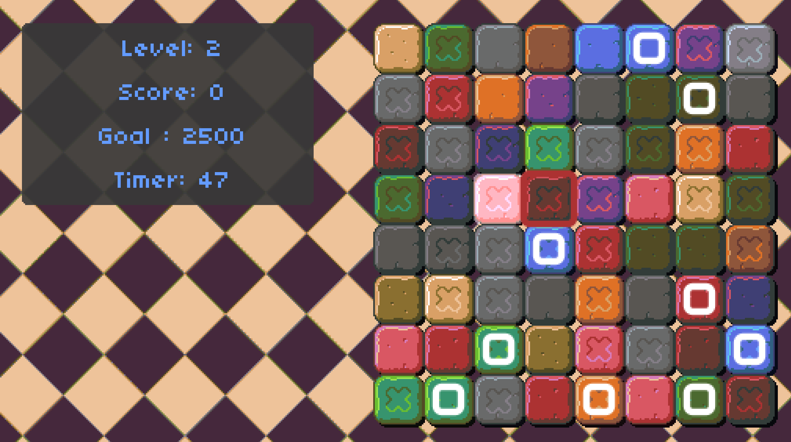

Matches is a game in the style of Bejeweled / Candy Crush for assignment 3 of CS50 Game Dev Class.

Made using LOVE2D game engine using CS50 GD distro code.

Project Requirements: https://www.youtube.com/redirect?q=https%3A%2F%2Fdocs.cs50.net%2Focw%2Fgames%2Fassignments%2F3%2Fassignment3.html&redir_token=GsQJN8qNzW18emhcLoLOhPHa8GJ8MTU4NzY1NTcxOEAxNTg3NTY5MzE4&v=o4Z_pUSIsnE&event=video_description

YouTube Demo: https://youtu.be/o4Z_pUSIsnE
